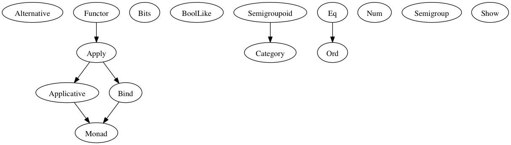

Module Documentation
====================

Module Prelude
--------------

Types
~~~~~

::

    data Ordering  where
      LT :: Ordering 
      GT :: Ordering 
      EQ :: Ordering 

Type Classes
~~~~~~~~~~~~

   Prelude
::

    class Alternative f where
      empty :: forall a. f a
      (<|>) :: forall a. f a -> f a -> f a

    class (Apply f) <= Applicative f where
      pure :: forall a. a -> f a

    class (Functor f) <= Apply f where
      (<*>) :: forall a b. f (a -> b) -> f a -> f b

    class (Apply m) <= Bind m where
      (>>=) :: forall a b. m a -> (a -> m b) -> m b

    class Bits b where
      (&) :: b -> b -> b
      (|) :: b -> b -> b
      (^) :: b -> b -> b
      shl :: b -> Prim.Number -> b
      shr :: b -> Prim.Number -> b
      zshr :: b -> Prim.Number -> b
      complement :: b -> b

    class BoolLike b where
      (&&) :: b -> b -> b
      (||) :: b -> b -> b
      not :: b -> b

    class (Semigroupoid a) <= Category a where
      id :: forall t. a t t

    class Eq a where
      (==) :: a -> a -> Prim.Boolean
      (/=) :: a -> a -> Prim.Boolean

    class Functor f where
      (<$>) :: forall a b. (a -> b) -> f a -> f b

    class (Applicative m, Bind m) <= Monad m where

    class Num a where
      (+) :: a -> a -> a
      (-) :: a -> a -> a
      (*) :: a -> a -> a
      (/) :: a -> a -> a
      (%) :: a -> a -> a
      negate :: a -> a

    class (Eq a) <= Ord a where
      compare :: a -> a -> Ordering

    class Semigroup a where
      (<>) :: a -> a -> a

    class Semigroupoid a where
      (<<<) :: forall b c d. a c d -> a b c -> a b d

    class Show a where
      show :: a -> Prim.String

Type Class Instances
~~~~~~~~~~~~~~~~~~~~

::

    instance bitsNumber :: Bits Prim.Number

    instance boolLikeBoolean :: BoolLike Prim.Boolean

    instance categoryArr :: Category Prim.Function

    instance eqArray :: (Eq a) => Eq [a]

    instance eqBoolean :: Eq Prim.Boolean

    instance eqNumber :: Eq Prim.Number

    instance eqOrdering :: Eq Ordering

    instance eqString :: Eq Prim.String

    instance numNumber :: Num Prim.Number

    instance ordNumber :: Ord Prim.Number

    instance semigroupString :: Semigroup Prim.String

    instance semigroupoidArr :: Semigroupoid Prim.Function

    instance showArray :: (Show a) => Show [a]

    instance showBoolean :: Show Prim.Boolean

    instance showNumber :: Show Prim.Number

    instance showOrdering :: Show Ordering

    instance showString :: Show Prim.String

Values
~~~~~~

::

    (#) :: forall a b. a -> (a -> b) -> b

    ($) :: forall a b. (a -> b) -> a -> b

    (++) :: forall s. (Semigroup s) => s -> s -> s

    (:) :: forall a. a -> [a] -> [a]

    (<) :: forall a. (Ord a) => a -> a -> Prim.Boolean

    (<=) :: forall a. (Ord a) => a -> a -> Prim.Boolean

    (>) :: forall a. (Ord a) => a -> a -> Prim.Boolean

    (>=) :: forall a. (Ord a) => a -> a -> Prim.Boolean

    (>>>) :: forall a b c d. (Semigroupoid a) => a b c -> a c d -> a b d

    ap :: forall m a b. (Monad m) => m (a -> b) -> m a -> m b

    asTypeOf :: forall a. a -> a -> a

    boolAnd :: Prim.Boolean -> Prim.Boolean -> Prim.Boolean

    boolNot :: Prim.Boolean -> Prim.Boolean

    boolOr :: Prim.Boolean -> Prim.Boolean -> Prim.Boolean

    concatString :: Prim.String -> Prim.String -> Prim.String

    cons :: forall a. a -> [a] -> [a]

    const :: forall a b. a -> b -> a

    flip :: forall a b c. (a -> b -> c) -> b -> a -> c

    liftA1 :: forall f a b. (Applicative f) => (a -> b) -> f a -> f b

    liftM1 :: forall m a b. (Monad m) => (a -> b) -> m a -> m b

    numAdd :: Prim.Number -> Prim.Number -> Prim.Number

    numAnd :: Prim.Number -> Prim.Number -> Prim.Number

    numCompare :: Prim.Number -> Prim.Number -> Ordering

    numComplement :: Prim.Number -> Prim.Number

    numDiv :: Prim.Number -> Prim.Number -> Prim.Number

    numMod :: Prim.Number -> Prim.Number -> Prim.Number

    numMul :: Prim.Number -> Prim.Number -> Prim.Number

    numNegate :: Prim.Number -> Prim.Number

    numOr :: Prim.Number -> Prim.Number -> Prim.Number

    numShl :: Prim.Number -> Prim.Number -> Prim.Number

    numShr :: Prim.Number -> Prim.Number -> Prim.Number

    numSub :: Prim.Number -> Prim.Number -> Prim.Number

    numXor :: Prim.Number -> Prim.Number -> Prim.Number

    numZshr :: Prim.Number -> Prim.Number -> Prim.Number

    refEq :: forall a. a -> a -> Prim.Boolean

    refIneq :: forall a. a -> a -> Prim.Boolean

    return :: forall m a. (Monad m) => a -> m a

    showArrayImpl :: forall a. (a -> Prim.String) -> [a] -> Prim.String

    showNumberImpl :: Prim.Number -> Prim.String

    showStringImpl :: Prim.String -> Prim.String

Module Data.Function
--------------------

Types
~~~~~

Type Classes
~~~~~~~~~~~~

Type Class Instances
~~~~~~~~~~~~~~~~~~~~

Values
~~~~~~

::

    on :: forall a b c. (b -> b -> c) -> (a -> b) -> a -> a -> c

Module Data.Eq
--------------

Types
~~~~~

::

    data Ref a where
      Ref :: a -> Ref a

Type Classes
~~~~~~~~~~~~

Type Class Instances
~~~~~~~~~~~~~~~~~~~~

::

    instance eqRef :: Eq (Ref a)

Values
~~~~~~

::

    liftRef :: forall a b. (a -> a -> b) -> Ref a -> Ref a -> b

Module Prelude.Unsafe
---------------------

Types
~~~~~

Type Classes
~~~~~~~~~~~~

Type Class Instances
~~~~~~~~~~~~~~~~~~~~

Values
~~~~~~

::

    unsafeIndex :: forall a. [a] -> Prim.Number -> a

Module Control.Monad.Eff
------------------------

Types
~~~~~

::

    data Eff :: # ! -> * -> *

    type Pure a = forall e. Eff e a

Type Classes
~~~~~~~~~~~~

Type Class Instances
~~~~~~~~~~~~~~~~~~~~

::

    instance applicativeEff :: Applicative (Eff e)

    instance applyEff :: Apply (Eff e)

    instance bindEff :: Bind (Eff e)

    instance functorEff :: Functor (Eff e)

    instance monadEff :: Monad (Eff e)

Values
~~~~~~

::

    bindE :: forall e a b. Eff e a -> (a -> Eff e b) -> Eff e b

    forE :: forall e. Prim.Number -> Prim.Number -> (Prim.Number -> Eff e {  }) -> Eff e {  }

    foreachE :: forall e a. [a] -> (a -> Eff e {  }) -> Eff e {  }

    returnE :: forall e a. a -> Eff e a

    runPure :: forall a. Pure a -> a

    untilE :: forall e. Eff e Prim.Boolean -> Eff e {  }

    whileE :: forall e a. Eff e Prim.Boolean -> Eff e a -> Eff e {  }

Module Control.Monad.Eff.Unsafe
-------------------------------

Types
~~~~~

Type Classes
~~~~~~~~~~~~

Type Class Instances
~~~~~~~~~~~~~~~~~~~~

Values
~~~~~~

::

    unsafeInterleaveEff :: forall eff1 eff2 a. Eff eff1 a -> Eff eff2 a

Module Debug.Trace
------------------

Types
~~~~~

::

    data Trace :: !

Type Classes
~~~~~~~~~~~~

Type Class Instances
~~~~~~~~~~~~~~~~~~~~

Values
~~~~~~

::

    print :: forall a r. (Show a) => a -> Eff (trace :: Trace | r) {  }

    trace :: forall r. Prim.String -> Eff (trace :: Trace | r) {  }

Module Control.Monad.ST
-----------------------

Types
~~~~~

::

    data ST :: * -> !

    data STArray :: * -> * -> *

    data STRef :: * -> * -> *

Type Classes
~~~~~~~~~~~~

Type Class Instances
~~~~~~~~~~~~~~~~~~~~

Values
~~~~~~

::

    modifySTRef :: forall a h r. STRef h a -> (a -> a) -> Eff (st :: ST h | r) a

    newSTArray :: forall a h r. Prim.Number -> a -> Eff (st :: ST h | r) (STArray h a)

    newSTRef :: forall a h r. a -> Eff (st :: ST h | r) (STRef h a)

    peekSTArray :: forall a h r. STArray h a -> Eff (st :: ST h | r) a

    pokeSTArray :: forall a h r. STArray h a -> Prim.Number -> a -> Eff (st :: ST h | r) a

    readSTRef :: forall a h r. STRef h a -> Eff (st :: ST h | r) a

    runST :: forall a r. (forall h. Eff (st :: ST h | r) a) -> Eff r a

    runSTArray :: forall a r. (forall h. Eff (st :: ST h | r) (STArray h a)) -> Eff r [a]

    writeSTRef :: forall a h r. STRef h a -> a -> Eff (st :: ST h | r) a

