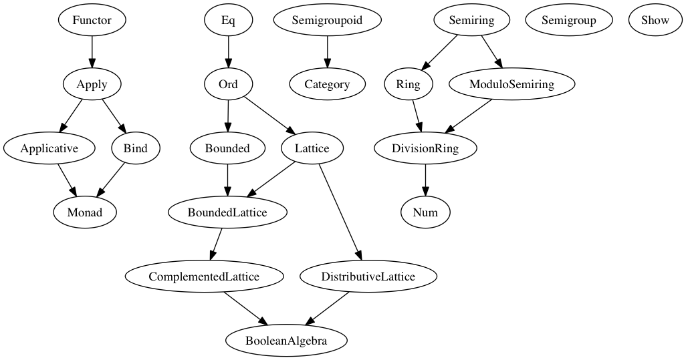

# Module Documentation

## Module Prelude

### Types

#### `Ordering`

    data Ordering
      = LT 
      | GT 
      | EQ 

#### `Unit`

    newtype Unit
      = Unit {  }

### Type Classes

#### `Applicative`

    class (Apply f) <= Applicative f where
      pure :: forall a. a -> f a

#### `Apply`

    class (Functor f) <= Apply f where
      (<*>) :: forall a b. f (a -> b) -> f a -> f b

#### `Bind`

    class (Apply m) <= Bind m where
      (>>=) :: forall a b. m a -> (a -> m b) -> m b

#### `Bits`

    class Bits b where
      (.&.) :: b -> b -> b
      (.|.) :: b -> b -> b
      (.^.) :: b -> b -> b
      shl :: b -> Number -> b
      shr :: b -> Number -> b
      zshr :: b -> Number -> b
      complement :: b -> b

#### `BoolLike`

    class BoolLike b where
      (&&) :: b -> b -> b
      (||) :: b -> b -> b
      not :: b -> b

#### `Category`

    class (Semigroupoid a) <= Category a where
      id :: forall t. a t t

#### `Eq`

    class Eq a where
      (==) :: a -> a -> Boolean
      (/=) :: a -> a -> Boolean

#### `Functor`

    class Functor f where
      (<$>) :: forall a b. (a -> b) -> f a -> f b

#### `Monad`

    class (Applicative m, Bind m) <= Monad m where

#### `Num`

    class Num a where
      (+) :: a -> a -> a
      (-) :: a -> a -> a
      (*) :: a -> a -> a
      (/) :: a -> a -> a
      (%) :: a -> a -> a
      negate :: a -> a

#### `Ord`

    class (Eq a) <= Ord a where
      compare :: a -> a -> Ordering

#### `Semigroup`

    class Semigroup a where
      (<>) :: a -> a -> a

#### `Semigroupoid`

    class Semigroupoid a where
      (<<<) :: forall b c d. a c d -> a b c -> a b d

#### `Show`

    class Show a where
      show :: a -> String

### Type Class Instances

#### `applicativeArr`

    instance applicativeArr :: Applicative (Prim.Function r)

#### `applyArr`

    instance applyArr :: Apply (Prim.Function r)

#### `bindArr`

    instance bindArr :: Bind (Prim.Function r)

#### `bitsNumber`

    instance bitsNumber :: Bits Number

#### `boolLikeBoolean`

    instance boolLikeBoolean :: BoolLike Boolean

#### `categoryArr`

    instance categoryArr :: Category Prim.Function

#### `eqArray`

    instance eqArray :: (Eq a) => Eq [a]

#### `eqBoolean`

    instance eqBoolean :: Eq Boolean

#### `eqNumber`

    instance eqNumber :: Eq Number

#### `eqOrdering`

    instance eqOrdering :: Eq Ordering

#### `eqString`

    instance eqString :: Eq String

#### `eqUnit`

    instance eqUnit :: Eq Unit

#### `functorArr`

    instance functorArr :: Functor (Prim.Function r)

#### `monadArr`

    instance monadArr :: Monad (Prim.Function r)

#### `numNumber`

    instance numNumber :: Num Number

#### `ordArray`

    instance ordArray :: (Ord a) => Ord [a]

#### `ordBoolean`

    instance ordBoolean :: Ord Boolean

#### `ordNumber`

    instance ordNumber :: Ord Number

#### `ordString`

    instance ordString :: Ord String

#### `ordUnit`

    instance ordUnit :: Ord Unit

#### `semigroupArr`

    instance semigroupArr :: (Semigroup s') => Semigroup (s -> s')

#### `semigroupString`

    instance semigroupString :: Semigroup String

#### `semigroupUnit`

    instance semigroupUnit :: Semigroup Unit

#### `semigroupoidArr`

    instance semigroupoidArr :: Semigroupoid Prim.Function

#### `showArray`

    instance showArray :: (Show a) => Show [a]

#### `showBoolean`

    instance showBoolean :: Show Boolean

#### `showNumber`

    instance showNumber :: Show Number

#### `showOrdering`

    instance showOrdering :: Show Ordering

#### `showString`

    instance showString :: Show String

#### `showUnit`

    instance showUnit :: Show Unit

### Values

#### `(#)`

    (#) :: forall a b. a -> (a -> b) -> b

#### `($)`

    ($) :: forall a b. (a -> b) -> a -> b

#### `(++)`

    (++) :: forall s. (Semigroup s) => s -> s -> s

#### `(:)`

    (:) :: forall a. a -> [a] -> [a]

#### `(<#>)`

    (<#>) :: forall f a b. (Functor f) => f a -> (a -> b) -> f b

#### `(<)`

    (<) :: forall a. (Ord a) => a -> a -> Boolean

#### `(<=)`

    (<=) :: forall a. (Ord a) => a -> a -> Boolean

#### `(>)`

    (>) :: forall a. (Ord a) => a -> a -> Boolean

#### `(>=)`

    (>=) :: forall a. (Ord a) => a -> a -> Boolean

#### `(>>>)`

    (>>>) :: forall a b c d. (Semigroupoid a) => a b c -> a c d -> a b d

#### `ap`

    ap :: forall m a b. (Monad m) => m (a -> b) -> m a -> m b

#### `asTypeOf`

This function returns its first argument, and can be used to assert type equalities.
This can be useful when types are otherwise ambiguous. 

E.g.

    main = print $ [] `asTypeOf` [0]

If instead, we had written `main = print []`, the type of the argument `[]` would have
been ambiguous, resulting in a compile-time error.

    asTypeOf :: forall a. a -> a -> a

#### `cons`

    cons :: forall a. a -> [a] -> [a]

#### `const`

Returns its first argument and ignores its second. 

    const :: forall a b. a -> b -> a

#### `flip`

Flips the order of the arguments to a function of two arguments. 

    flip :: forall a b c. (a -> b -> c) -> b -> a -> c

#### `liftA1`

    liftA1 :: forall f a b. (Applicative f) => (a -> b) -> f a -> f b

#### `liftM1`

    liftM1 :: forall m a b. (Monad m) => (a -> b) -> m a -> m b

#### `otherwise`

An alias for `true`, which can be useful in guard clauses: 

E.g.

    max x y | x >= y = x 
            | otherwise = y

    otherwise :: Boolean

#### `refEq`

    refEq :: forall a. a -> a -> Boolean

#### `refIneq`

    refIneq :: forall a. a -> a -> Boolean

#### `return`

    return :: forall m a. (Monad m) => a -> m a

#### `unit`

    unit :: Unit

#### `void`

    void :: forall f a. (Functor f) => f a -> f Unit

## Module Data.Function

### Types

#### `Fn0`

    data Fn0 :: * -> *

#### `Fn1`

    data Fn1 :: * -> * -> *

#### `Fn10`

    data Fn10 :: * -> * -> * -> * -> * -> * -> * -> * -> * -> * -> * -> *

#### `Fn2`

    data Fn2 :: * -> * -> * -> *

#### `Fn3`

    data Fn3 :: * -> * -> * -> * -> *

#### `Fn4`

    data Fn4 :: * -> * -> * -> * -> * -> *

#### `Fn5`

    data Fn5 :: * -> * -> * -> * -> * -> * -> *

#### `Fn6`

    data Fn6 :: * -> * -> * -> * -> * -> * -> * -> *

#### `Fn7`

    data Fn7 :: * -> * -> * -> * -> * -> * -> * -> * -> *

#### `Fn8`

    data Fn8 :: * -> * -> * -> * -> * -> * -> * -> * -> * -> *

#### `Fn9`

    data Fn9 :: * -> * -> * -> * -> * -> * -> * -> * -> * -> * -> *

### Values

#### `mkFn0`

    mkFn0 :: forall a. (Unit -> a) -> Fn0 a

#### `mkFn1`

    mkFn1 :: forall a b. (a -> b) -> Fn1 a b

#### `mkFn10`

    mkFn10 :: forall a b c d e f g h i j k. (a -> b -> c -> d -> e -> f -> g -> h -> i -> j -> k) -> Fn10 a b c d e f g h i j k

#### `mkFn2`

    mkFn2 :: forall a b c. (a -> b -> c) -> Fn2 a b c

#### `mkFn3`

    mkFn3 :: forall a b c d. (a -> b -> c -> d) -> Fn3 a b c d

#### `mkFn4`

    mkFn4 :: forall a b c d e. (a -> b -> c -> d -> e) -> Fn4 a b c d e

#### `mkFn5`

    mkFn5 :: forall a b c d e f. (a -> b -> c -> d -> e -> f) -> Fn5 a b c d e f

#### `mkFn6`

    mkFn6 :: forall a b c d e f g. (a -> b -> c -> d -> e -> f -> g) -> Fn6 a b c d e f g

#### `mkFn7`

    mkFn7 :: forall a b c d e f g h. (a -> b -> c -> d -> e -> f -> g -> h) -> Fn7 a b c d e f g h

#### `mkFn8`

    mkFn8 :: forall a b c d e f g h i. (a -> b -> c -> d -> e -> f -> g -> h -> i) -> Fn8 a b c d e f g h i

#### `mkFn9`

    mkFn9 :: forall a b c d e f g h i j. (a -> b -> c -> d -> e -> f -> g -> h -> i -> j) -> Fn9 a b c d e f g h i j

#### `on`

    on :: forall a b c. (b -> b -> c) -> (a -> b) -> a -> a -> c

#### `runFn0`

    runFn0 :: forall a. Fn0 a -> a

#### `runFn1`

    runFn1 :: forall a b. Fn1 a b -> a -> b

#### `runFn10`

    runFn10 :: forall a b c d e f g h i j k. Fn10 a b c d e f g h i j k -> a -> b -> c -> d -> e -> f -> g -> h -> i -> j -> k

#### `runFn2`

    runFn2 :: forall a b c. Fn2 a b c -> a -> b -> c

#### `runFn3`

    runFn3 :: forall a b c d. Fn3 a b c d -> a -> b -> c -> d

#### `runFn4`

    runFn4 :: forall a b c d e. Fn4 a b c d e -> a -> b -> c -> d -> e

#### `runFn5`

    runFn5 :: forall a b c d e f. Fn5 a b c d e f -> a -> b -> c -> d -> e -> f

#### `runFn6`

    runFn6 :: forall a b c d e f g. Fn6 a b c d e f g -> a -> b -> c -> d -> e -> f -> g

#### `runFn7`

    runFn7 :: forall a b c d e f g h. Fn7 a b c d e f g h -> a -> b -> c -> d -> e -> f -> g -> h

#### `runFn8`

    runFn8 :: forall a b c d e f g h i. Fn8 a b c d e f g h i -> a -> b -> c -> d -> e -> f -> g -> h -> i

#### `runFn9`

    runFn9 :: forall a b c d e f g h i j. Fn9 a b c d e f g h i j -> a -> b -> c -> d -> e -> f -> g -> h -> i -> j

## Module Prelude.Unsafe

### Values

#### `unsafeIndex`

    unsafeIndex :: forall a. [a] -> Number -> a

## Module Control.Monad.Eff

### Types

#### `Eff`

    data Eff :: # ! -> * -> *

#### `Pure`

    type Pure a = forall e. Eff e a

### Type Class Instances

#### `applicativeEff`

    instance applicativeEff :: Applicative (Eff e)

#### `applyEff`

    instance applyEff :: Apply (Eff e)

#### `bindEff`

    instance bindEff :: Bind (Eff e)

#### `functorEff`

    instance functorEff :: Functor (Eff e)

#### `monadEff`

    instance monadEff :: Monad (Eff e)

### Values

#### `bindE`

    bindE :: forall e a b. Eff e a -> (a -> Eff e b) -> Eff e b

#### `forE`

    forE :: forall e. Number -> Number -> (Number -> Eff e Unit) -> Eff e Unit

#### `foreachE`

    foreachE :: forall e a. [a] -> (a -> Eff e Unit) -> Eff e Unit

#### `returnE`

    returnE :: forall e a. a -> Eff e a

#### `runPure`

    runPure :: forall a. Pure a -> a

#### `untilE`

    untilE :: forall e. Eff e Boolean -> Eff e Unit

#### `whileE`

    whileE :: forall e a. Eff e Boolean -> Eff e a -> Eff e Unit

## Module Control.Monad.Eff.Unsafe

### Values

#### `unsafeInterleaveEff`

    unsafeInterleaveEff :: forall eff1 eff2 a. Eff eff1 a -> Eff eff2 a

## Module Debug.Trace

### Types

#### `Trace`

    data Trace :: !

### Values

#### `print`

    print :: forall a r. (Show a) => a -> Eff (trace :: Trace | r) Unit

#### `trace`

    trace :: forall r. String -> Eff (trace :: Trace | r) Unit

## Module Control.Monad.ST

### Types

#### `ST`

    data ST :: * -> !

#### `STRef`

    data STRef :: * -> * -> *

### Values

#### `modifySTRef`

    modifySTRef :: forall a h r. STRef h a -> (a -> a) -> Eff (st :: ST h | r) a

#### `newSTRef`

    newSTRef :: forall a h r. a -> Eff (st :: ST h | r) (STRef h a)

#### `pureST`

    pureST :: forall a. (forall h r. Eff (st :: ST h | r) a) -> a

#### `readSTRef`

    readSTRef :: forall a h r. STRef h a -> Eff (st :: ST h | r) a

#### `runST`

    runST :: forall a r. (forall h. Eff (st :: ST h | r) a) -> Eff r a

#### `writeSTRef`

    writeSTRef :: forall a h r. STRef h a -> a -> Eff (st :: ST h | r) a

