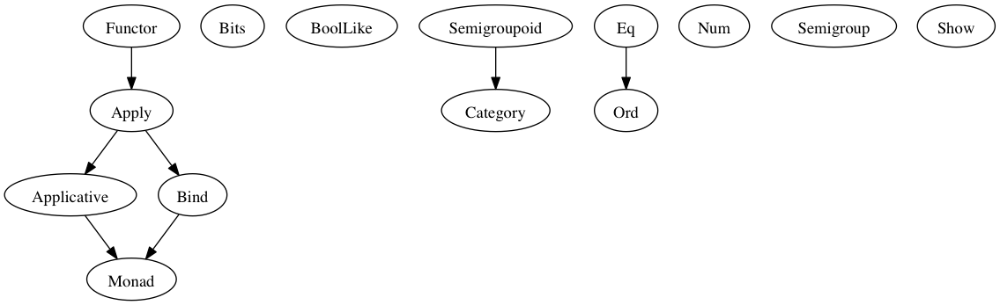

# Module Documentation

## Module Prelude

### Types

#### `Ordering`

Represents the result of a comparison operation in which one item being
compared can be less than, greater than, or equal to the other.

    data Ordering
      = LT 
      | GT 
      | EQ 

#### `Unit`

    newtype Unit
      = Unit {  }

### Type Classes

#### `Applicative`

    class (Apply f) <= Applicative f where
      pure :: forall a. a -> f a

#### `Apply`

Pass arguments into a Functor-wrapped function, returning a new wrapped
result.

`Just (+) <*> Just 5 <*> Nothing == Nothing`

    class (Functor f) <= Apply f where
      (<*>) :: forall a b. f (a -> b) -> f a -> f b

#### `Bind`

Compose monadic actions together, passing the result of one as the 
input to the next.

    class (Apply m) <= Bind m where
      (>>=) :: forall a b. m a -> (a -> m b) -> m b

#### `Bits`

Bitwise operations on data.

    class Bits b where
      (.&.) :: b -> b -> b
      (.|.) :: b -> b -> b
      (.^.) :: b -> b -> b
      shl :: b -> Number -> b
      shr :: b -> Number -> b
      zshr :: b -> Number -> b
      complement :: b -> b

#### `BoolLike`

Perform Boolean logic operators on data.

    class BoolLike b where
      (&&) :: b -> b -> b
      (||) :: b -> b -> b
      not :: b -> b

#### `Category`

    class (Semigroupoid a) <= Category a where
      id :: forall t. a t t

#### `Eq`

Determine whether two data of the same type are equal.

    class Eq a where
      (==) :: a -> a -> Boolean
      (/=) :: a -> a -> Boolean

#### `Functor`

Apply a function to the data contained in a Functor type, returning a
new wrapped result.

`not <$> Just true == Just false`

    class Functor f where
      (<$>) :: forall a b. (a -> b) -> f a -> f b

#### `Monad`

    class (Applicative m, Bind m) <= Monad m where

#### `Num`

Perform arithmetic-like operations on data.

    class Num a where
      (+) :: a -> a -> a
      (-) :: a -> a -> a
      (*) :: a -> a -> a
      (/) :: a -> a -> a
      (%) :: a -> a -> a
      negate :: a -> a

#### `Ord`

Compare the ranking of two data of the same type.

`compare 1 10 == LT`

    class (Eq a) <= Ord a where
      compare :: a -> a -> Ordering

#### `Semigroup`

Concatenation-like operation.

    class Semigroup a where
      (<>) :: a -> a -> a

#### `Semigroupoid`

    class Semigroupoid a where
      (<<<) :: forall b c d. a c d -> a b c -> a b d

#### `Show`

Converts data to a String.

`show 1 == "1"`

    class Show a where
      show :: a -> String

### Type Class Instances

#### `applicativeArr`

    instance applicativeArr :: Applicative (Prim.Function r)

#### `applyArr`

    instance applyArr :: Apply (Prim.Function r)

#### `bindArr`

    instance bindArr :: Bind (Prim.Function r)

#### `bitsNumber`

    instance bitsNumber :: Bits Number

#### `boolLikeBoolean`

Standard boolean AND and OR.

`true && false == false`
`true || false == true`

    instance boolLikeBoolean :: BoolLike Boolean

#### `categoryArr`

    instance categoryArr :: Category Prim.Function

#### `eqArray`

Determine whether two Arrays are equal.

`[1, 2, 3] == [1, 2, 3]`

    instance eqArray :: (Eq a) => Eq [a]

#### `eqBoolean`

Determine whether two Booleans are equal.

`true /= false`

    instance eqBoolean :: Eq Boolean

#### `eqNumber`

Determine whether two Numbers are equal.

`1 == 1`

    instance eqNumber :: Eq Number

#### `eqOrdering`

Determine whether two Orderings are equal.

`compare 1 2 == compare 1 100`

    instance eqOrdering :: Eq Ordering

#### `eqString`

Determine whether two Strings are equal.

`"string" == "string"`

    instance eqString :: Eq String

#### `eqUnit`

    instance eqUnit :: Eq Unit

#### `functorArr`

    instance functorArr :: Functor (Prim.Function r)

#### `monadArr`

    instance monadArr :: Monad (Prim.Function r)

#### `numNumber`

Standard arithmetic operations on Numbers. `%` is modulo.

    instance numNumber :: Num Number

#### `ordArray`

Compare the contents of two Arrays of the same type.  The first element
of the left array is compared to the first argument of the right array, 
second element with second element, etc, until the two compared elements
are not equal.  If one array is a prefix of the other, the shorter array
is less than the longer one.

`compare [1, 2, 3] [5] == LT`
`compare [1, 2, 3] [1, 2, 3, 4] == LT`

    instance ordArray :: (Ord a) => Ord [a]

#### `ordBoolean`

Compare two Booleans.  True is greater than false.

`compare false true == LT`

    instance ordBoolean :: Ord Boolean

#### `ordNumber`

Compare the value of two Numbers.

`compare 1 100 == LT`

    instance ordNumber :: Ord Number

#### `ordString`

Compare Strings ranked alphabetically (by character value).

`compare "alphabetically" "bob" == LT`

    instance ordString :: Ord String

#### `ordUnit`

Compare two Units.  Always returns `EQ`.

`compare unit unit == true`

    instance ordUnit :: Ord Unit

#### `semigroupArr`

    instance semigroupArr :: (Semigroup s') => Semigroup (s -> s')

#### `semigroupString`

Concatenate two Strings.

`"try" <> " purescript" == "try purescript"

    instance semigroupString :: Semigroup String

#### `semigroupUnit`

    instance semigroupUnit :: Semigroup Unit

#### `semigroupoidArr`

Function composition in right to left sense.

`(f <<< g) x == f (g x)`

    instance semigroupoidArr :: Semigroupoid Prim.Function

#### `showArray`

`show [1, 2, 3] == "[1, 2, 3]"`

    instance showArray :: (Show a) => Show [a]

#### `showBoolean`

`show true == "true"`

    instance showBoolean :: Show Boolean

#### `showNumber`

`show 1 == "1"`

    instance showNumber :: Show Number

#### `showOrdering`

    instance showOrdering :: Show Ordering

#### `showString`

`show "abc" == "abc"`

    instance showString :: Show String

#### `showUnit`

`show (Unit {}) == "Unit {}"`

    instance showUnit :: Show Unit

### Values

#### `(#)`

Applies the second argument to the first, making a forwards pipe.

`"str" ++ "ing" # reverse == "gnirts"`

    (#) :: forall a b. a -> (a -> b) -> b

#### `($)`

Applies the first argument to the second, making a backward pipe.

`reverse $ "str" ++ "ing" == "gnirts"`

    ($) :: forall a b. (a -> b) -> a -> b

#### `(++)`

Alias for (<>), typically used for String or Array concatenation as a
style choice.

`[1, 2, 3] ++ [4, 5] == [1, 2, 3, 4, 5]`

    (++) :: forall s. (Semigroup s) => s -> s -> s

#### `(:)`

Prepends an element to a list.

`"try" : ["purescript", "today"] == ["try", "purescript", "today"]`

    (:) :: forall a. a -> [a] -> [a]

#### `(<#>)`

Reversed version of (<$>).

`Just true <#> not == Just false`

    (<#>) :: forall f a b. (Functor f) => f a -> (a -> b) -> f b

#### `(<)`

Returns true if the left argument is "less than" the right argument.

`1 < 10 == true`

    (<) :: forall a. (Ord a) => a -> a -> Boolean

#### `(<=)`

Returns true if the left argument is "greater than or equal to" the 
right argument.

`1 <= 1 == true`

    (<=) :: forall a. (Ord a) => a -> a -> Boolean

#### `(>)`

Returns true if the left argument is "greater than" the right argument.

`1 > 10 == false`

    (>) :: forall a. (Ord a) => a -> a -> Boolean

#### `(>=)`

Returns true if the left argument is "less than or equal to" the 
right argument.

`1 >= 1 == true`

    (>=) :: forall a. (Ord a) => a -> a -> Boolean

#### `(>>>)`

Function composition in left to right sense.

`(f >>> g) x == g (f x)`

    (>>>) :: forall a b c d. (Semigroupoid a) => a b c -> a c d -> a b d

#### `ap`

    ap :: forall m a b. (Monad m) => m (a -> b) -> m a -> m b

#### `asTypeOf`

This function returns its first argument, and can be used to assert type equalities.
This can be useful when types are otherwise ambiguous. 

E.g.

    main = print $ [] `asTypeOf` [0]

If instead, we had written `main = print []`, the type of the argument `[]` would have
been ambiguous, resulting in a compile-time error.

    asTypeOf :: forall a. a -> a -> a

#### `cons`

    cons :: forall a. a -> [a] -> [a]

#### `const`

Returns its first argument and ignores its second. 

`const 7 "whatever" == 7`

    const :: forall a b. a -> b -> a

#### `flip`

Flips the order of the arguments to a function of two arguments. 

`flip (/) 6 3 == 3 / 6`

    flip :: forall a b c. (a -> b -> c) -> b -> a -> c

#### `liftA1`

Apply a function to the data contained in an Applicative type, returning
a new Applicative result.

`liftA1 not (Just true) == Just false`

    liftA1 :: forall f a b. (Applicative f) => (a -> b) -> f a -> f b

#### `liftM1`

Apply a function to the data in a Monad type, returning a new Monad 
result.

    liftM1 :: forall m a b. (Monad m) => (a -> b) -> m a -> m b

#### `otherwise`

An alias for `true`, which can be useful in guard clauses: 

E.g.

    max x y | x >= y = x 
            | otherwise = y

    otherwise :: Boolean

#### `refEq`

    refEq :: forall a. a -> a -> Boolean

#### `refIneq`

    refIneq :: forall a. a -> a -> Boolean

#### `return`

    return :: forall m a. (Monad m) => a -> m a

#### `unit`

    unit :: Unit

#### `void`

Replace the contents of a Functor with Unit.

`void (Just false) == Just unit`

    void :: forall f a. (Functor f) => f a -> f Unit

## Module Data.Function

### Types

#### `Fn0`

Function of 0 arguments using Javascript calling conventions.

    data Fn0 :: * -> *

#### `Fn1`

Function of 1 arguments using Javascript calling conventions.

    data Fn1 :: * -> * -> *

#### `Fn10`

    data Fn10 :: * -> * -> * -> * -> * -> * -> * -> * -> * -> * -> * -> *

#### `Fn2`

Function of 2 arguments using Javascript calling conventions.

    data Fn2 :: * -> * -> * -> *

#### `Fn3`

    data Fn3 :: * -> * -> * -> * -> *

#### `Fn4`

    data Fn4 :: * -> * -> * -> * -> * -> *

#### `Fn5`

    data Fn5 :: * -> * -> * -> * -> * -> * -> *

#### `Fn6`

    data Fn6 :: * -> * -> * -> * -> * -> * -> * -> *

#### `Fn7`

    data Fn7 :: * -> * -> * -> * -> * -> * -> * -> * -> *

#### `Fn8`

    data Fn8 :: * -> * -> * -> * -> * -> * -> * -> * -> * -> *

#### `Fn9`

    data Fn9 :: * -> * -> * -> * -> * -> * -> * -> * -> * -> * -> *

### Values

#### `mkFn0`

Convert a purescript function of type `Unit -> a` to JS calling
convention.

    mkFn0 :: forall a. (Unit -> a) -> Fn0 a

#### `mkFn1`

Convert a purescript function of 1 argument to JS calling convention.

    mkFn1 :: forall a b. (a -> b) -> Fn1 a b

#### `mkFn10`

    mkFn10 :: forall a b c d e f g h i j k. (a -> b -> c -> d -> e -> f -> g -> h -> i -> j -> k) -> Fn10 a b c d e f g h i j k

#### `mkFn2`

Convert a purescript function of 2 argument to JS calling convention.

    mkFn2 :: forall a b c. (a -> b -> c) -> Fn2 a b c

#### `mkFn3`

    mkFn3 :: forall a b c d. (a -> b -> c -> d) -> Fn3 a b c d

#### `mkFn4`

    mkFn4 :: forall a b c d e. (a -> b -> c -> d -> e) -> Fn4 a b c d e

#### `mkFn5`

    mkFn5 :: forall a b c d e f. (a -> b -> c -> d -> e -> f) -> Fn5 a b c d e f

#### `mkFn6`

    mkFn6 :: forall a b c d e f g. (a -> b -> c -> d -> e -> f -> g) -> Fn6 a b c d e f g

#### `mkFn7`

    mkFn7 :: forall a b c d e f g h. (a -> b -> c -> d -> e -> f -> g -> h) -> Fn7 a b c d e f g h

#### `mkFn8`

    mkFn8 :: forall a b c d e f g h i. (a -> b -> c -> d -> e -> f -> g -> h -> i) -> Fn8 a b c d e f g h i

#### `mkFn9`

    mkFn9 :: forall a b c d e f g h i j. (a -> b -> c -> d -> e -> f -> g -> h -> i -> j) -> Fn9 a b c d e f g h i j

#### `on`

Apply a function to two arguments, then combine the results with a second
function.

`on (*) length "argument1" "arg2" == 9 * 4`

    on :: forall a b c. (b -> b -> c) -> (a -> b) -> a -> a -> c

#### `runFn0`

Run a function with 0 arguments and Javascript calling conventions 
in purescript.  Useful for writing JS function bindings.

    runFn0 :: forall a. Fn0 a -> a

#### `runFn1`

Run a function with 1 argument and Javascript calling conventions 
in purescript.  Useful for writing JS function bindings.

    runFn1 :: forall a b. Fn1 a b -> a -> b

#### `runFn10`

    runFn10 :: forall a b c d e f g h i j k. Fn10 a b c d e f g h i j k -> a -> b -> c -> d -> e -> f -> g -> h -> i -> j -> k

#### `runFn2`

Run a function with 2 arguments and Javascript calling conventions 
in purescript.  Useful for writing JS function bindings.

    runFn2 :: forall a b c. Fn2 a b c -> a -> b -> c

#### `runFn3`

    runFn3 :: forall a b c d. Fn3 a b c d -> a -> b -> c -> d

#### `runFn4`

    runFn4 :: forall a b c d e. Fn4 a b c d e -> a -> b -> c -> d -> e

#### `runFn5`

    runFn5 :: forall a b c d e f. Fn5 a b c d e f -> a -> b -> c -> d -> e -> f

#### `runFn6`

    runFn6 :: forall a b c d e f g. Fn6 a b c d e f g -> a -> b -> c -> d -> e -> f -> g

#### `runFn7`

    runFn7 :: forall a b c d e f g h. Fn7 a b c d e f g h -> a -> b -> c -> d -> e -> f -> g -> h

#### `runFn8`

    runFn8 :: forall a b c d e f g h i. Fn8 a b c d e f g h i -> a -> b -> c -> d -> e -> f -> g -> h -> i

#### `runFn9`

    runFn9 :: forall a b c d e f g h i j. Fn9 a b c d e f g h i j -> a -> b -> c -> d -> e -> f -> g -> h -> i -> j

## Module Prelude.Unsafe

### Values

#### `unsafeIndex`

Index into an Array.  No bounds checking is performed on the index.

    unsafeIndex :: forall a. [a] -> Number -> a

## Module Control.Monad.Eff

### Types

#### `Eff`

Monad for executing native Javascript effects.

    data Eff :: # ! -> * -> *

#### `Pure`

    type Pure a = forall e. Eff e a

### Type Class Instances

#### `applicativeEff`

    instance applicativeEff :: Applicative (Eff e)

#### `applyEff`

    instance applyEff :: Apply (Eff e)

#### `bindEff`

    instance bindEff :: Bind (Eff e)

#### `functorEff`

    instance functorEff :: Functor (Eff e)

#### `monadEff`

    instance monadEff :: Monad (Eff e)

### Values

#### `bindE`

Compose effectful actions, passing the result of the first as the input
to the second.

    bindE :: forall e a b. Eff e a -> (a -> Eff e b) -> Eff e b

#### `forE`

    forE :: forall e. Number -> Number -> (Number -> Eff e Unit) -> Eff e Unit

#### `foreachE`

    foreachE :: forall e a. [a] -> (a -> Eff e Unit) -> Eff e Unit

#### `returnE`

Wrap a pure value into an effectful context.

    returnE :: forall e a. a -> Eff e a

#### `runPure`

Run an effectful computation with no side effects, either because there 
are none or because all possible side effects are handled.

    runPure :: forall a. Pure a -> a

#### `untilE`

    untilE :: forall e. Eff e Boolean -> Eff e Unit

#### `whileE`

    whileE :: forall e a. Eff e Boolean -> Eff e a -> Eff e Unit

## Module Control.Monad.Eff.Unsafe

### Values

#### `unsafeInterleaveEff`

    unsafeInterleaveEff :: forall eff1 eff2 a. Eff eff1 a -> Eff eff2 a

## Module Debug.Trace

### Types

#### `Trace`

    data Trace :: !

### Values

#### `print`

    print :: forall a r. (Show a) => a -> Eff (trace :: Trace | r) Unit

#### `trace`

    trace :: forall r. String -> Eff (trace :: Trace | r) Unit

## Module Control.Monad.ST

### Types

#### `ST`

    data ST :: * -> !

#### `STRef`

    data STRef :: * -> * -> *

### Values

#### `modifySTRef`

    modifySTRef :: forall a h r. STRef h a -> (a -> a) -> Eff (st :: ST h | r) a

#### `newSTRef`

    newSTRef :: forall a h r. a -> Eff (st :: ST h | r) (STRef h a)

#### `pureST`

    pureST :: forall a. (forall h r. Eff (st :: ST h | r) a) -> a

#### `readSTRef`

    readSTRef :: forall a h r. STRef h a -> Eff (st :: ST h | r) a

#### `runST`

    runST :: forall a r. (forall h. Eff (st :: ST h | r) a) -> Eff r a

#### `writeSTRef`

    writeSTRef :: forall a h r. STRef h a -> a -> Eff (st :: ST h | r) a

